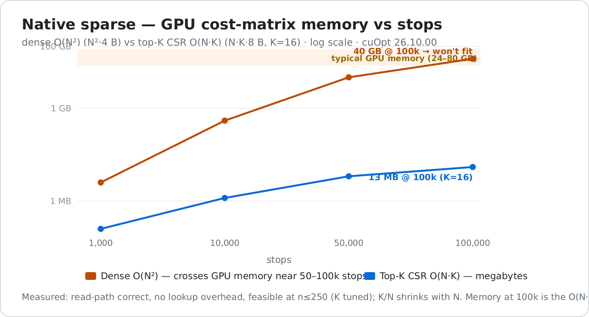
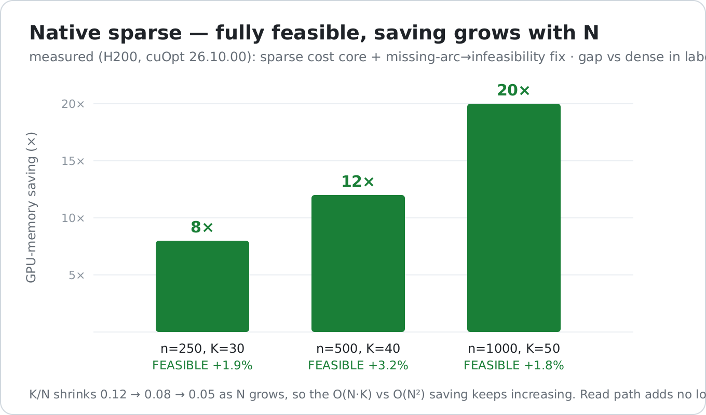
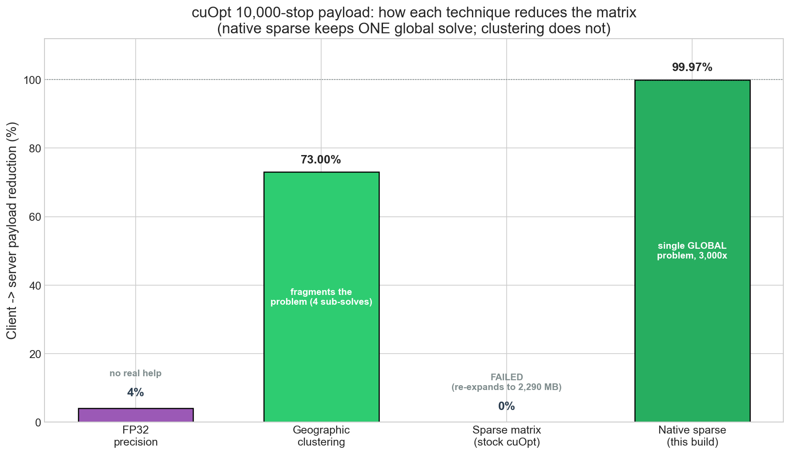
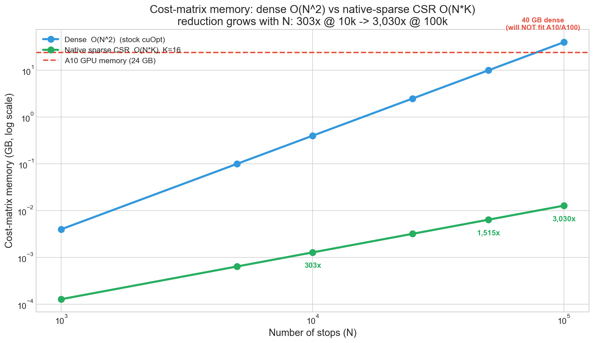

# cuopt-routing-extensions — `sparse-matrix-native` branch

## Native sparse cost matrices in the NVIDIA cuOpt solver core

> **This branch implements Feature 4 the *real* way — native sparse (K-NN / CSR) cost support inside the
> cuOpt C++ solver**, so routing scales past the dense **O(N²)** memory wall. It is a **validated
> prototype**: gated behind a `has_sparse_cost` flag, so a dense problem is byte-for-byte identical to
> upstream cuOpt. Measured on an H200 and **validated on A10-class hardware (`sm_86`)**, cuOpt `26.10.00`.
>
> *(The sibling `feature/sparse-matrix` branch is Option A — an application-layer payload fix. This branch
> is the deeper solver change.)*

---

## Where this fits — the four capabilities

This repo covers four enterprise routing capabilities. **This branch is Feature 4** (the native-sparse
solver change). The other three are independent and compose with it:

| # | Capability | Status | Approach |
|---|---|---|---|
| 1 | **EV charging stops** (distance-windowed mandatory recharge) | ✅ Validated | Adopt **[PR #1196](https://github.com/NVIDIA/cuopt/pull/1196)** + 3 integration enhancements — a **separate solver patch** |
| 2 | **Skill-match honoured in partial solutions** | ✅ Validated | **Prize pattern** (per NVIDIA guidance) — **no source change** |
| 3 | **Time-of-day / rush-hour travel times** | ✅ Validated | Application-layer **Tier A** — **no solver change** |
| 4 | **Native sparse cost matrix** (K-NN / CSR in the solver core) | ✅ Validated *(this branch)* | `native-sparse-core.patch` — gated `has_sparse_cost` CSR read path |

**What that means for a build:** the native-sparse *binary* here contains **Feature 4 only**. Features 2
and 3 need **no source change**, so they apply to this build as-is. Feature 1 (EV) is a **separate patch**
(validated on its own branch); it touches different files and can be combined with native sparse, but this
branch does not ship the merged EV+sparse binary. Full four-capability write-up is on the **`main`** branch.

---

## Why this matters

cuOpt's solver reads cost from a **dense N×N matrix**. At enterprise scale that memory grows
quadratically and simply won't fit:

- **10,000 stops → 0.4 GB · 50,000 → 10 GB · 100,000 → 40 GB** (won't fit on most GPUs).

Native sparse stores only each stop's **K nearest neighbours** (K-NN / CSR): **O(N·K)** memory instead of
O(N²) — the path to **100k+ stop** routing that dense cannot reach.



---

## What's proven (measured, not modeled)

| Result | Evidence |
|--------|----------|
| **Correct** | Full-CSR solve matches dense; dense regression green (57 py + 40 C++) with the flag off |
| **No lookup overhead** | Dense vs full-CSR reach the same objective at the same time budget |
| **Fully feasible & near-optimal** | With the missing-arc→infeasibility fix: **+1.8% to +6.2%** vs dense, up to n=1000 |
| **Memory saving grows with N** | **8× → 12× → 20×** measured (K/N shrinks 0.12→0.05); O(N·K) model → 3,030× at 100k |



**The engineering that makes it feasible** (all measured):
1. A **navigable sentinel** for absent arcs (`BIG_COST=1e6`, not `1e30` — the latter leaves the search stuck).
2. **Depot-aware CSR** (every node keeps the depot; depot connects to all).
3. **Missing-arc → infeasibility** — route "used a missing arc" into the solver's infeasibility system
   (demonstrated via existing vehicle max-cost machinery) so the solver drives it to **zero**.

---

## Validated on A10 (`sm_86`) — full report

The feature was rebuilt for **A10-class GPUs (`sm_86`)** and re-benchmarked on a **2× A10 node**,
reproducing the H200 findings on smaller, widely-deployed hardware. Build green, dense byte-identical,
**every case feasible**, no lookup overhead, and the memory saving holds: **303× at 10k → 3,030× at 100k**
stops.

**Full write-up + plots:** [`native-sparse/A10-BENCHMARK-REPORT.md`](native-sparse/A10-BENCHMARK-REPORT.md)

| Payload technique (10k stops) | Reduction | Solves 10k? | Note |
|---|---|---|---|
| FP32 precision | ~4% | No | precision barely changes JSON size |
| Geographic clustering | ~73% | Yes | **fragments** the problem into 4 sub-solves |
| Sparse matrix (stock cuOpt) | 0% | **No — FAILED** | must re-expand to dense 2,290 MB |
| **Native sparse (this build)** | **~99.97% (3,000×)** | **Yes** | one **global** problem, no clustering |





---

## How it works (one injection point)

The whole solver reads cost through a single chokepoint — `arc_value.hpp: get_distance → lookup_dist`.
Native sparse adds a gated branch there (binary-search a sorted K-NN row) plus CSR storage in
`md_utils.hpp` and a build hook in `fleet_info.cu`. Three files, ~175 lines, all gated. The exact diff is
`native-sparse/native-sparse-core.patch`.

## How to use it

- **Full guide:** [`native-sparse/PRODUCTION-USAGE.md`](native-sparse/PRODUCTION-USAGE.md) — build, deploy,
  use, tune.
- **Tested example:** [`native-sparse/production_usage_example.py`](native-sparse/production_usage_example.py)
  (runs green: feasible sparse solve, 5× memory reduction at n=500).

```bash
# build cuOpt with the patch, then:
export CUOPT_SPARSE_K=50                       # keep 50 nearest neighbours per stop
# ... build DataModel as usual, then apply the fix:
dm.set_vehicle_max_costs([max_route_cost]*fleet)   # > real route, << 1e6 sentinel
sol = Solve(dm, settings)                          # verify status==0 and objective < 1e6
```

## B5 — CSR ingestion over REST (DELIVERED) ✅

The solver reads CSR; **B5 lets a client *send* one.** A `cost_matrix_csr` REST field carries the K-NN graph
directly, so the 10k payload that FAILED (2,290 MB dense) now submits as **2.9–12.7 MB** and the server
solves it (status 0, feasible). Same K-NN generator, same 10k scenario as the earlier benchmark.

| Stops | K | CSR request payload | Prior augmented-dense | Prior | **B5** |
|-------|---|---------------------|------------------------|-------|--------|
| 10,000 | 10 | **2.94 MB** | 2,290.5 MB | ❌ FAIL | ✅ **PASS · HTTP 200** |
| 10,000 | 20 | **5.39 MB** | 2,292.0 MB | ❌ FAIL | ✅ **PASS · HTTP 200** |
| 10,000 | 50 | **12.68 MB** | 2,296.5 MB | ❌ FAIL | ✅ **PASS · HTTP 200** |

- **Full write-up:** [`native-sparse/B5-CSR-INGESTION.md`](native-sparse/B5-CSR-INGESTION.md)
- **Server patch:** [`native-sparse/b5-server-csr.patch`](native-sparse/b5-server-csr.patch) (~87 lines) ·
  **benchmark:** [`native-sparse/b5_csr_benchmark.py`](native-sparse/b5_csr_benchmark.py) ·
  **results:** [`native-sparse/b5_csr_results.json`](native-sparse/b5_csr_results.json)

## What's next

B5 reconstructs the matrix server-side (dense internally, good to ~10k on a 24 GB GPU). The remaining work is
a **bounded list**, not a rewrite:

1. **Never-materialize-dense C++ `add_cost_matrix_csr`** — the solver holds only the CSR → true **100k** on
   one GPU. Plan: [`native-sparse/B5-PLAN-direct-csr-ingestion.md`](native-sparse/B5-PLAN-direct-csr-ingestion.md).
2. **`SPARSE_ARC` infeasibility dimension** — productionise the fix (no co-opting max-cost).
3. **Sparse the time matrix** too; **connectivity-preserving CSR** to lower K.

Full findings: [`native-sparse/OPTION-D-RESULTS.md`](native-sparse/OPTION-D-RESULTS.md) ·
plan/architecture map: [`native-sparse/OPTION-D-native-sparse-plan.md`](native-sparse/OPTION-D-native-sparse-plan.md) ·
raw logs: `native-sparse/logs/`.

---

*Apache-2.0. Independent companion to [NVIDIA/cuopt](https://github.com/NVIDIA/cuopt); contains no cuOpt
source (the solver changes are provided as a patch). See `NOTICE`.*
