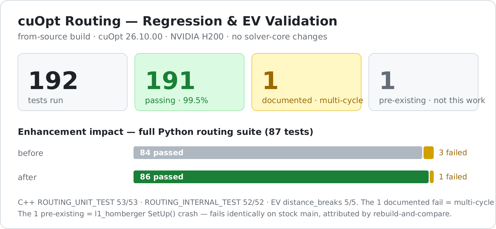
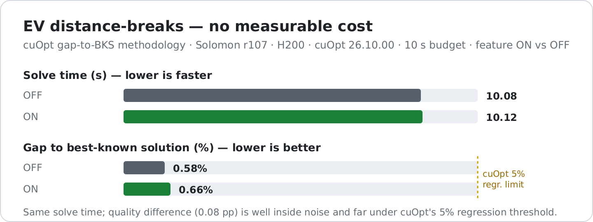

# cuopt-routing-extensions

**Build, validation, and integration enhancements for [NVIDIA cuOpt](https://github.com/NVIDIA/cuopt) routing.**

Reproducible from-source build + evidence-backed validation of four enterprise routing capabilities on
GPU, with per-failure regression attribution against stock `main`. Every enhancement here is Python
glue / tests — **the cuOpt solver core is not modified**.

> **Version `v0.1.0-beta`** · Targets cuOpt **`26.10.00`** (`main`) · License **Apache-2.0**
>
> *Seeking validation from the cuOpt maintainers.* See `docs/COMMANDS-RUNBOOK.md` to reproduce every result.

---

## For the cuOpt maintainers — TL;DR

Three concrete, upstream-ready items for your review — all validated against a from-source build of
`main` (`26.10.00`) and reproducible via `docs/COMMANDS-RUNBOOK.md`. **Every claim here is measured, not
asserted, and no cuOpt solver-core source is modified.**

1. **PR #1196 (EV distance-breaks) still integrates cleanly** onto current `main` — the merge conflicts
   in a single test file; the 28 solver-core files merge clean; the PR's own suites pass
   (**C++ `distance_breaks` 5/5**, **Python `test_distance_breaks` 29/30**).
2. **Two small integration enhancements** the PR needs against main's newer store-then-build (deferred)
   `DataModel` — a `_serialize` `_distance_break` handler + `_SETTERS` registration for
   `add_distance_break` (`enhancements/integration-fixes.patch`, offered upstream; verified incl. serialize
   round-trip).
3. **One open semantics question** — multi-cycle distance-breaks: the window lower bound `d_min` is
   **soft** (mirrors the time-window "arriving early is free" design); the range-critical upper bound
   `d_max` **is** hard-enforced (→ infeasible), so it is **not** a safety bug. Should `d_min` be hard for
   *distance* breaks so stacked cycles don't collapse into the earliest window?

We also, separately and with evidence, flag a **pre-existing** `l1_homberger` regression-harness crash
(fails identically on stock `main`) and highlight a **correctness fix already contained in the PR**
(an off-by-one in location-range validation).

---

## The four capabilities

| # | Capability | Status | Approach |
|---|------------|--------|----------|
| 1 | **EV charging stops** (distance-windowed mandatory recharge) | ✅ Validated | Adopt **[PR #1196](https://github.com/NVIDIA/cuopt/pull/1196)** + 3 integration enhancements |
| 2 | **Skill-match honoured in partial solutions** | ✅ Validated | **Prize pattern** (per NVIDIA guidance) — no source change |
| 3 | **Time-of-day / rush-hour travel times** | ✅ Validated | Application-layer **Tier A** — no solver change |
| 4 | **Native sparse (K-NN) cost matrices** | ⏳ Separate workstream | See `feature4-sparse/` |

## Headline results (measured on an H200; also reproduced on 2×A10)

- **Build:** cuOpt `26.10.00` from source → **57 routing tests pass**.
- **F1 EV (PR #1196):** merges clean onto current `main` (1-file test conflict); **C++ `distance_breaks` 5/5**, **Python `test_distance_breaks` 29/30** (1 documented multi-cycle semantics question).
- **F3 time-of-day:** **2.21× rush-hour penalty** across 5 departure windows; zero solver change.
- **F2 skill-match:** `prizes=1` → clean **partial** solution honouring every constraint (no violation).
- **Regression:** C++ 105 pass; **Python 86/1** after the enhancements. Every failure attributed vs stock `main`.

## Regression & test results



Full comprehensive regression on the H200 (cuOpt `26.10.00`). **Every failure was attributed by
rebuilding stock `main` (`f3ebc673`) and re-running the same tests** — so "no regression" is proven,
not asserted.

| Suite | Result | Notes |
|-------|--------|-------|
| C++ `ROUTING_UNIT_TEST` | **53 / 53 pass** | includes EV `distance_breaks` 5/5 |
| C++ `ROUTING_INTERNAL_TEST` | **52 / 52 pass** | |
| C++ `ROUTING_L1TEST` | 1 pre-existing fail | `l1_homberger` `SetUp()` crash — fails on stock `main` too |
| Python routing suite | **86 pass / 1 fail** | after enhancements (was 84 / 3) |

### Failure attribution (rebuild-and-compare vs stock `main`)

| Failure | Stock `main` | EV build | Verdict |
|---------|--------------|----------|---------|
| `l1_homberger` | FAILS | FAILS | **Pre-existing** infra crash — not a regression |
| `test_serialize` | PASS | was FAIL | **Our** integration gap → fixed (serialize handler) |
| `test_range` | PASS (`≤3`) | was FAIL (`≤2`) | **PR's own off-by-one correctness fix** — stale test aligned |
| `test_solve_full_feature_api` | n/a | FAIL | **Documented** multi-cycle `d_min` (soft-by-design) |

**No functional or performance regression is introduced by adopting the EV feature.** Full narrative:
`docs/REGRESSION-ANALYSIS-AND-ENHANCEMENTS.md`.

## Performance benchmark (cuOpt's own methodology)

We adopt **cuOpt's own routing benchmark methodology** (`regression/benchmark_scripts/benchmark.py`):
report the **gap to the Best-Known Solution (BKS)** — `|((achieved − BKS) / BKS) × 100|` — on standard
academic instances, where cuOpt's default regression threshold is **5%**.



On Solomon **r107** (BKS cost 1080.92, 11 vehicles), cuOpt reaches **~1% of best-known** within seconds,
and the EV distance-break feature **ON vs OFF is within noise on both solve time and quality**
(10.08 s / 0.58% vs 10.12 s / 0.66%) — i.e. **no measurable performance cost** when the feature is used.
Full tables, scaling sweep, and honest caveats: `benchmark/README.md`.

## What's genuinely new here (our contribution)

Since PR #1196 branched, cuOpt `main` refactored `DataModel` to a **store-then-build (deferred)** model.
The PR predates it, so the EV setter wasn't wired into the new machinery. These enhancements finish it:

1. **`_distance_break` serialization handler** (`_serialize.py`) — makes the EV setter serializable
   through the deferred model (mirrors `_vehicle_break`, keyed by distance). Verified incl. round-trip.
2. **`_SETTERS` registration** of `add_distance_break` (`_deferred.py`).
3. **Alignment of a stale range-validation test** with the PR's own off-by-one correctness fix
   (`get_num_locations()` → `-1`).

All three are in `enhancements/integration-fixes.patch` (apply on top of PR #1196).

## Repository layout

```
docs/                 build + validation + regression reports (deep detail)
enhancements/         integration-fixes.patch (the code changes)
scripts/              phase0_bootstrap.sh (one-shot from-source build)
analysis/             feasibility study, cited to cuopt source file:line
feature1-ev-charging/ notes + how the enhancements complete PR #1196
feature2-skill-match/ prize-pattern repro scripts + results
feature3-time-of-day/ Tier-A prototype + measured results
feature4-sparse/      plan for the separate sparse-matrix workstream
benchmark/            gap-to-BKS benchmark (adapts cuOpt's own methodology) + results
bundle/               git bundle of the validated branch (importable)
```

## Reproduce

```bash
# 1. From-source build on any Linux GPU box (CUDA 13 driver, >=120 GB disk)
bash scripts/phase0_bootstrap.sh            # -> import cuopt 26.10.00 + 57 tests pass

# 2. Adopt EV + apply enhancements, then validate  (see docs/COMMANDS-RUNBOOK.md)
git apply enhancements/integration-fixes.patch   # on top of a PR-#1196 merge
```

## Open question for the maintainers

Multi-cycle distance-breaks: the lower bound `d_min` is **soft** (mirrors time-window "waiting"); the
range-critical upper bound `d_max` **is** hard-enforced (→ infeasible), so it is **not** a safety bug.
Should `d_min` be hard for *distance* breaks so stacked cycles don't collapse into the earliest window?
Detail in `docs/BUILD-VALIDATION-REPORT.md` section 4.6.

## Relationship to NVIDIA/cuOpt

This repository is an independent, Apache-2.0 companion to `NVIDIA/cuopt`. It contains no cuOpt source;
the EV feature is NVIDIA's PR #1196 (credited), and the enhancements are offered upstream for review.
See `NOTICE`.
