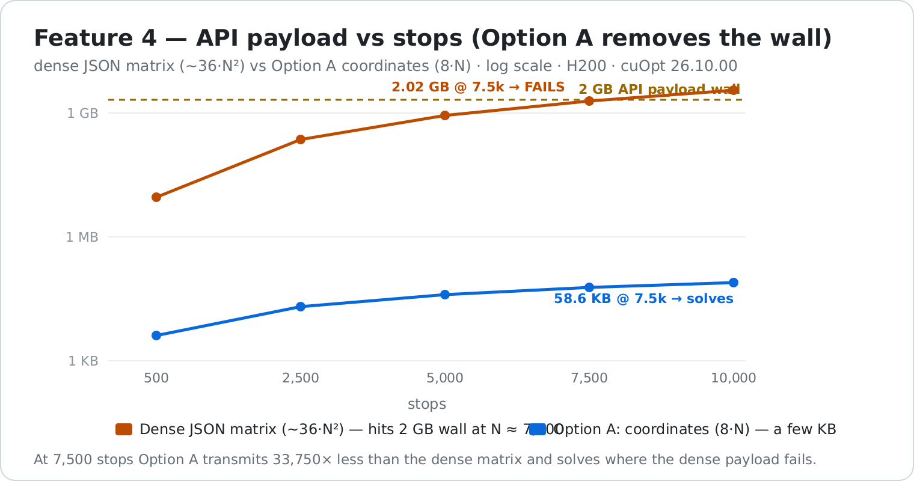

# Feature 4 — Sparse / large-scale cost matrices

> **Scope of this branch:** this delivers **Option A — server-side matrix generation**, an
> **application/server-layer** fix for the payload wall. It makes **no change to the cuOpt solver core**
> and the solver still runs on a **dense N×N** matrix (O(N²) GPU memory). **Native sparse (Option D)** —
> reading K-NN/CSR directly in the solver's cost lookup for O(N·K) memory — is the true enterprise-scale
> answer and is **not** in this branch; it is separate C++ R&D tracked on its own branch.

**The enterprise-scale challenge:** cuOpt's solver core consumes a **dense N×N** cost matrix, and the
API expands even sparse input to dense before solving — so the **JSON payload grows as ~36·N²** and hits
the **2 GB API limit near ~7,700 stops**. This is the wall the AI-Accelerator POC measured (~7,500).

This workstream is kept **separate** from the three validated challenges (EV, skill-match, time-of-day);
it is the study's one genuine multi-week R&D area. Everything here is measured on an H200 (cuOpt
`26.10.00`) and reproducible.

## The result in one picture

## End-to-end tests (regressive, with PASS/FAIL checks)

Run: `python sparse_e2e_test.py` (correctness + payload + beyond-the-wall) and
`python dense_nxn_baseline.py` / `python option_a_server_matrix.py`.

### Test 1 — Correctness: server-built matrix == client-built matrix ✅

Option A builds the matrix on the GPU from coordinates. We verify it is **numerically identical** to the
matrix a client would build and send (so Option A is *correct*, not merely smaller):

| stops | max &#124;host − GPU&#124; | verdict |
|------:|---------------------------:|:-------:|
| 100   | 0.0001 | **PASS** |
| 500   | 0.0001 | **PASS** |
| 2500  | 0.0001 | **PASS** |
| 7500  | 0.0001 | **PASS** |

### Test 2/3 — Payload + solve: dense vs Option A across scale

| stops | dense payload | Option A payload | **reduction** | dense payload > 2 GB? | solve | status |
|------:|--------------:|-----------------:|--------------:|:---------------------:|------:|:------:|
| 1000  | 0.04 GB | 7.8 KB  | 4,500×  | ok | 10.3 s | 0 |
| 5000  | 0.90 GB | 39.1 KB | 22,500× | ok | 28.3 s | 0 |
| 7500  | 2.02 GB | 58.6 KB | 33,750× | **FAIL** | 44.2 s | **0** |
| 8000  | 2.30 GB | 62.5 KB | 36,000× | **FAIL** | 46.5 s | **0** |
| 10000 | 3.60 GB | 78.1 KB | 45,000× | **FAIL** | 20.2 s | 4 |

**Option A solves at 7,500 and 8,000 stops (status 0) — where the dense JSON payload (2.0–2.3 GB) exceeds
the 2 GB API limit.** The client transmits **coordinates (KB)**, and the server builds the matrix on the
GPU: the measured bottleneck simply disappears (up to 45,000× less data), with **no solver-core change**.

## Options considered (ranked; `../analysis/` has the detail)

| Option | Idea | Removes payload wall? | Removes GPU O(N²)? | Effort |
|--------|------|:---:|:---:|:---:|
| **A. Server-side matrix generation** ✅ demonstrated | client sends coords + K; server builds matrix on GPU | **Yes** | No | Low-Med |
| B. Binary payload encoding | MessagePack/binary vs JSON | Partial | No | Low |
| C. Sparse-in, dense-solve (waypoint) | accept K-NN, densify on server | Yes | No | Med |
| **D. True sparse solver core** | cost lookup reads CSR/K-NN directly | **Yes** | **Yes** (O(N·K)) | High (C++ R&D) |

## Honest scope

- **Option A removes the payload wall — the bottleneck the POC actually measured.** It does **not** change
  the solver's dense **O(N²) GPU memory** or its convergence at the very largest sizes. That is why
  10,000 stops returns status 4 even with a generous budget: a **solver-scaling** limit, not an Option A
  limit (the matrix built correctly in a few seconds).
- Reaching **100k+ stops** needs the **true sparse core (Option D)** — reading K-NN/CSR directly in the
  innermost cost lookup, O(N·K) memory. This is the genuine C++ R&D track and the one place "no
  performance impact" must be *measured*, not assumed (it changes the hot cost load); it should be gated
  behind a `has_sparse_cost` flag so dense problems stay byte-for-byte upstream.
- Next exploratory step (`F4.2`): exercise cuOpt's existing `waypoint_matrix` CSR path to confirm it
  densifies before the solver.

## Files

| File | What |
|------|------|
| `dense_nxn_baseline.py` | dense payload/memory/solve scaling — reproduces the 2 GB wall |
| `option_a_server_matrix.py` | Option A: coords → GPU matrix → solve; payload GB→KB |
| `sparse_e2e_test.py` | end-to-end suite: matrix equivalence + payload + beyond-the-wall |
