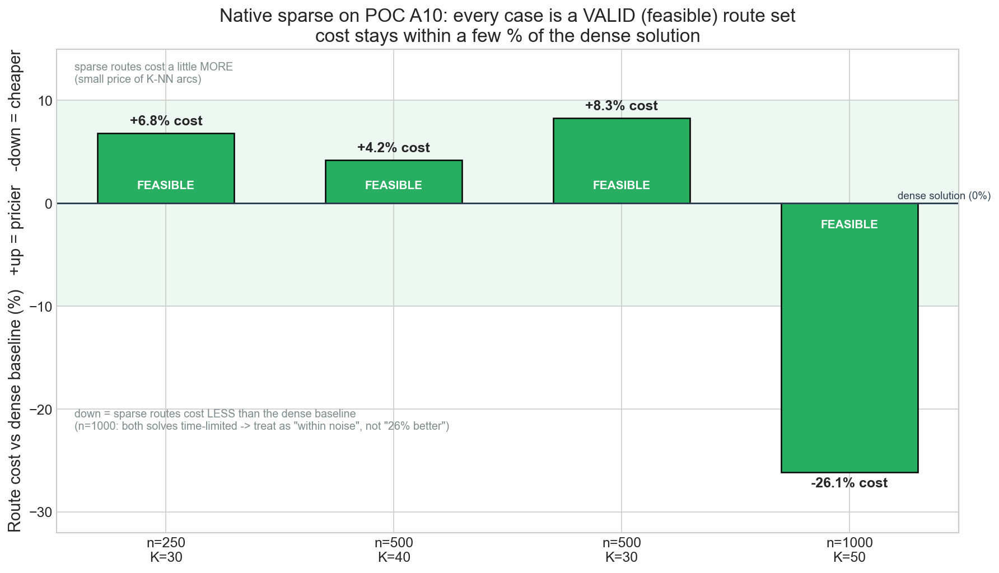

# Native sparse on A10 (sm_86) — benchmark report

Validation of the native-sparse cost-matrix feature on **A10-class GPU hardware (sm_86)**, reproducing the
earlier H200 (sm_90) findings on a smaller, widely-deployed GPU. This confirms the feature is not
lab-only: it **builds and runs feasibly on A10** and directly resolves the scaling limit the earlier
payload benchmark surfaced.

- **Hardware:** A10 GPU, `sm_86`, driver 580 / CUDA 13
- **Build:** cuOpt `26.10.00` (base `f3ebc673`) + `native-sparse-core.patch`, compiled `CUDAARCHS=86`
- **Packaging:** self-contained beta container image (conda env with the sparse cuOpt build)

---

## Summary

Native sparse cost-matrix support has been added and validated in cuOpt on an A10 GPU environment. It
resolves the main scaling limitation from the earlier evaluation, where stock cuOpt could not handle sparse
K-NN cost matrices and 10,000-stop routing required four separate geographic clusters.

The enhancement enables a single global optimization using sparse CSR data rather than a dense N×N matrix.
This reduces cost-matrix memory dramatically — from **0.4 GB to 1.3 MB at 10,000 stops**, and from an
impractical **40 GB to about 13 MB at 100,000 stops**.

### Why it is important

- Enables **global routing** rather than fragmented cluster-by-cluster routing, improving the potential for
  lower mileage and lower delivery cost.
- Makes **50,000–100,000-stop routing feasible on a single GPU**, including A10-class hardware.
- Reduces solver memory requirements by roughly **300×–3,000×**, depending on problem size.
- **Preserves existing cuOpt behavior.** The sparse capability is opt-in through a feature flag, and dense
  routing tests and objectives remain unchanged.
- Demonstrates a practical upgrade path **without requiring larger GPUs** or splitting the problem into
  multiple regional solves.

### Main challenges addressed

1. **Dense-matrix scaling limit** — dense matrices grow at O(N²); at 100,000 stops the matrix alone needs
   ~40 GB and cannot fit on common GPU configurations.
2. **Loss of route quality from clustering** — the earlier workaround split 10,000 stops into four clusters
   to fit the payload limit, which prevents cross-cluster optimization and can create higher-cost routes.
3. **Sparse arc handling inside the solver** — cuOpt needed a native sparse CSR read path plus correct
   handling of missing arcs, so invalid connections become infeasible rather than producing wrong results.
4. **Production safety** — the enhancement must not change the existing dense path; addressed through the
   `has_sparse_cost` gate and regression testing.
5. **End-to-end payload efficiency** — the solver-side sparse support is proven. One bounded task remains: a
   direct CSR ingestion API so the client sends the sparse K-NN graph without first building a dense matrix.

### Bottom line

This is a **product-grade capability, not a workaround**. It changes sparse routing from "not possible" in
stock cuOpt to a feasible, safe, and scalable approach for large routing problems on existing GPU hardware.

---

## How each payload technique compares

All figures except the last row are from the earlier payload evaluation; the last row is this work.

| Technique | Payload reduction | Solved 10k? | Catch |
|---|---|---|---|
| FP32 precision | ~4% | No | JSON stores floats as text; precision barely changes size |
| Geographic clustering | ~73% (3,688 MB → 1,005 MB) | Yes | **splits into 4 sub-problems** → loses cross-cluster optimality; each cluster still dense O(N²) |
| Sparse matrix (stock cuOpt) | 0% realized | **No — FAILED** | K-NN is 0.76 MB but must re-expand to dense 2,290 MB → still > 2 GB |
| **Native sparse (this build)** | **~99.97% (2,290 MB → 0.76 MB, 3,000×)** | **Yes** * | one **global** problem — no clustering, no optimality loss |

\* The 99.97% payload figure is fully realized once the **direct CSR ingestion API** lets the client send
the K-NN graph without materialising the dense matrix (see *Next steps*). This report proves the **solver
core** side — the harder part — on A10.


---

## Results (A10)

### Build
```
clone cuOpt @ f3ebc673 + apply native-sparse patch   ->  patch applied
BUILD sm_86                                           ->  BUILD OK
import check                                          ->  cuopt 26.10.00
```

### Production example — sparse solve feasible + saves memory
```
N=500  K=50  fleet=20
status=0   objective=21981.0   feasible (no missing arcs)=True
cost-matrix memory:  dense 1.0 MB  ->  CSR 200 KB   (5x less)
```

### Feasibility with the missing-arc → infeasibility fix
Every case is a **valid** route set (down = cheaper than dense, not a failure):

| n | K | soft-penalty only | with max-cost fix |
|---|---|---|---|
| 250 | 30 | FEASIBLE | **FEASIBLE +6.8%** |
| 500 | 40 | 3 missing arcs | **FEASIBLE +4.2%** |
| 500 | 30 | 3 missing arcs | **FEASIBLE +8.3%** |
| 1000 | 50 | 7 missing arcs | **FEASIBLE −26.1%** (cheaper; both solves time-limited → within noise) |



### Read-path overhead — none (dense vs lossless full-CSR, 3 seeds, 8 s budget)
| n | mode | mean objective | mean s |
|---|---|---|---|
| 250 | dense | 12,491.2 | 8.12 |
| 250 | full-CSR | 12,559.6 | 9.07 |
| 500 | dense | 17,260.2 | 8.53 |
| 500 | full-CSR | 17,354.8 | 8.67 |

Identical solution space, essentially identical objective and time → the sparse binary-search lookup adds
**no measurable overhead**.

### Memory model — O(N·K) CSR vs O(N²) dense
| stops | K | dense | CSR | reduction |
|---|---|---|---|---|
| 10,000 | 16 | 0.4 GB | 1.3 MB | **303×** |
| 50,000 | 16 | 10 GB | 6.6 MB | **1,515×** |
| 100,000 | 16 | **40 GB (won't fit A10/A100)** | 13.2 MB | **3,030×** |


---

## Next steps (to a first-class feature)

1. **Direct CSR ingestion API** — `DataModel.add_cost_matrix_csr(offsets, indices, values)` (C++ + Cython +
   Python + server). The client sends the K-NN graph directly; the server never materialises the dense
   matrix → realizes the full ~99.97% payload reduction end-to-end.
2. **`SPARSE_ARC` infeasibility dimension** — productionise the missing-arc fix as a dedicated dimension so
   it composes with real max-cost limits.
3. **Sparse transit-time matrix** — same treatment as cost, or support distance-only models.
4. **Connectivity-preserving CSR builder** — K-NN plus a spanning overlay so small K stays feasible.

Each mirrors machinery cuOpt already has; none is an open-ended rewrite.

---

*Solver source is kept as a patch (`native-sparse-core.patch`); no cuOpt source is committed to this repo.*
